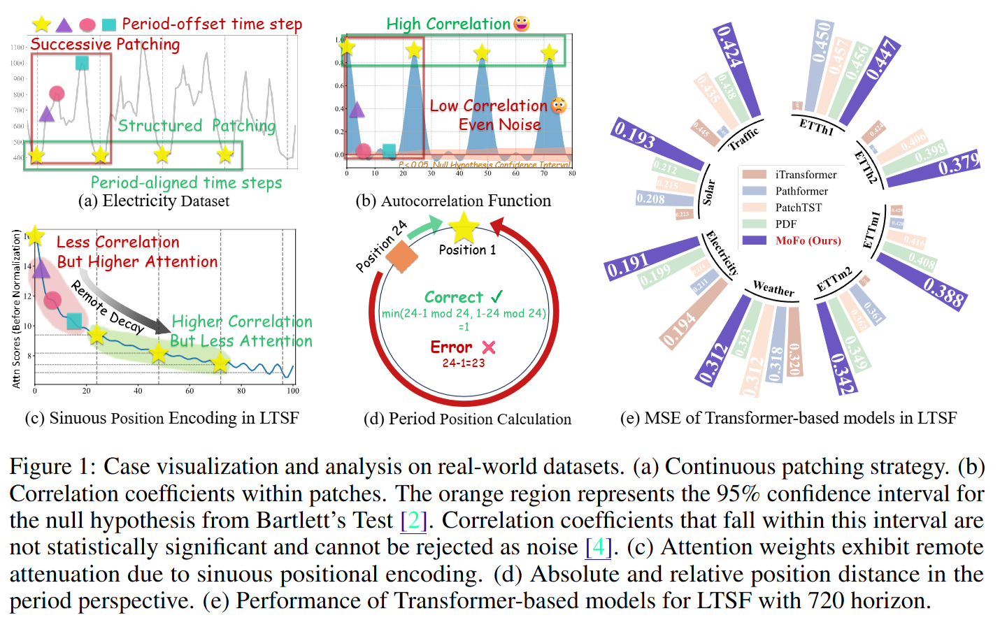

# MoFo: Empowering Long-term Time Series Forecasting with Periodic Pattern Modeling (NeurIPS 2025)
This is the official repository of our NeurIPS 2025 Paper. This paper introduces MoFo, which interprets periodicity as both the correlation of period-aligned time steps and the trend of period-offset time steps. We first design period-structured patches—2D tensors generated through discrete sampling—where each row contains only period-aligned time steps, enabling direct modeling of periodic correlations. Period-offset time steps within a cycle are aligned in columns. To capture trends across these offset time steps, we introduce a period-aware modulator. This modulator introduces an adaptive strong inductive bias through a regulated relaxation function, encouraging the model to generate attention coefficients that align with periodic trends. This function is end-to-end trainable, enabling the model to adaptively capture the distinct periodic patterns across diverse datasets. Extensive empirical results on popular benchmark datasets demonstrate that MoFo achieves competitive performance compared to 17 advanced baselines, while offering up to 14x memory efficiency gain and 10x faster training speed.



## 1. Introduction about the code
### 1.1 Coding Framework
All of our experiments are running on the [TFB](https://github.com/decisionintelligence/TFB) coding framework. To run MoFo, you need to configure your environment and datasets according to their requirements.

<br>

## 2. Environmental Requirments
The experiment requires the same environment as [TFB](https://github.com/decisionintelligence/TFB).

<br>

## 3. Reproduction of the Long-term Time Series Forecasting
All the experimental running on MoFo are integrated within file `/scripts/MoFo.sh`. You can run it through the following commands,
```
sh MoFo.sh
```

## 4. Citation
```bibtex
@inproceedings{ma2025mofo, 
  title     =  {MoFo: Empowering Long-term Time Series Forecasting with Periodic Pattern Modeling},
  author    = {Ma, Jiaming and Wang, Binwu and Huang, Qihe and Wang, Guanjun and Wang, Pengkun and Zhou, Zhengyang and Wang, Yang},
  booktitle = {Advances in Neural Information Processing Systems},
  year      = {2025}
}
```
